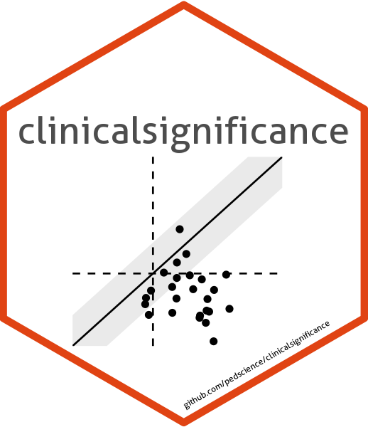
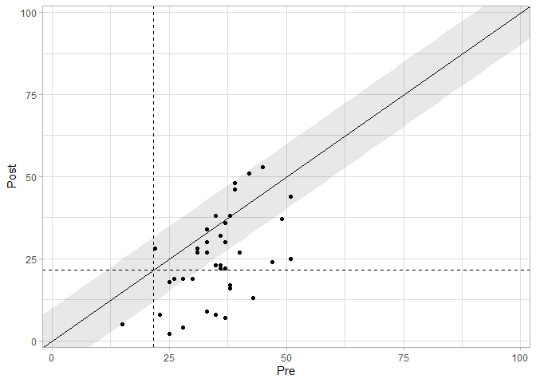

<!-- README.md is generated from README.Rmd. Please edit that file -->

# clinicalsignificance 

<!-- badges: start -->

[](https://CRAN.R-project.org/package=clinicalsignificance)
[](https://app.codecov.io/gh/pedscience/clinicalsignificance)
<!-- badges: end -->

The goal of this package is to provide all necessary tools for analyses
of clinical significance in clinical intervention studies. In contrast
to *statistical* significance, which assesses if it is probable that
there is a treatment effect, *clinical* significance can be used to
determine if a treatment effect is of practical use or meaningful for
patients.

## Installation

You can install the development version of clinicalsignificance from
[GitHub](https://github.com/) with:

``` r
# The easiest way to get clinicalsignificance is to install it from CRAN:
install.packages("clinicalsignificance")

# Or you install the development version from GitHub:
# install.packages("devtools")
devtools::install_github("pedscience/clinicalsignificance")
```

## Example

Given a tidy dataset, the employed instrument’s reliability and
descriptives (*M* and *SD*) of the functional population, the clinical
significance in a study can be easily assessed.

``` r
library(clinicalsignificance)

results <- claus_2020 %>% 
  clinical_significance(
    id = id, 
    time = time, 
    outcome = bdi, 
    pre = 1, 
    post = 4, 
    reliability = 0.81, 
    m_functional = 8, 
    sd_functional = 8, 
    type = "c"
  )

results
#> Clinical Significance Results (JT)
#> 
#> Category     |  n | Percent
#> ---------------------------
#> Recovered    | 10 |   0.250
#> Improved     |  9 |   0.225
#> Unchanged    | 21 |   0.525
#> Deteriorated |  0 |   0.000
#> Harmed       |  0 |   0.000
```

You can receive a detailed summary of the analysis by

``` r
summary(results)
#> 
#> Clinical Significance Results
#> 
#> There were 43 participants in the whole dataset of which 40 (93%)
#> could be included in the analysis.
#> 
#> The JT method for calculating cutoffs and reliable change was chosen
#> and the outcome variable was "bdi".
#> 
#> The cutoff type was "c" with a value of 21.6 based on the following
#> population characteristics (with lower values representing a
#> beneficial outcome):
#> 
#> Population Characteristics
#> 
#> M Clinical | SD Clinical | M Functional | SD Functional
#> -------------------------------------------------------
#> 35.48      | 8.16        | 8            | 8            
#> 
#> 
#> The instrument's reliability was set to 0.81 
#> 
#> Individual Level Results
#> 
#> Category     |  n | Percent
#> ---------------------------
#> Recovered    | 10 |   0.250
#> Improved     |  9 |   0.225
#> Unchanged    | 21 |   0.525
#> Deteriorated |  0 |   0.000
#> Harmed       |  0 |   0.000
```

or plot the results with

``` r
plot(results)
```



## Rationale

Jacobson et al. (1984) criticized, along with other researchers, that
the vast majority of research in psychological intervention research is
based on statistical significance testing. This procedure comes with two
major disadvantages: first, treatment effects are based on groups and
lack information on individual participants. Second, a significance test
lacks practical relevance. One can think of a hypothetical intervention
that expands life expectancy by 1 day. With enough participants
incorporated in a significance test, one can virtually guarantee a
significant result although most would agree that such an intervention
lacks practical relevance.

Therefore, Jacobson et al. (1984) postulated an additional procedure
that categorizes each patient based on his/her individual change. If a
patient (reliably) moves from the dysfunctional to a functional
population, this patient’s change is **clinically significant**. This
case is depicted in the figure below.

Let’s suppose an instrument assessing depressive symptoms. A clinical
population of patients with a major depression may score on average with
*M* = 34 and an *SD* = 8 on this instrument. A functional population (in
this case a sample of people without a major depression) may score on
average with *M* = 8 and an *SD* = 8 on that same instrument. If now an
individual patient with major depression scores 32 on the depression
instrument before and intervention (black point in the clinical
population) and 12 after an intervention (black point in the functional
population) and therefore has crossed the cutoff between the two
populations (the black line in between), then this patient has changed
clinically significant (if that change is beyond the error of
measurement of the instrument).


## References

<div id="refs" class="references csl-bib-body hanging-indent"
line-spacing="2">

<div id="ref-Jacobson.1984" class="csl-entry">

Jacobson, N. S., Follette, W. C., & Revenstorf, D. (1984). <span
class="nocase">Psychotherapy outcome research: Methods for reporting
variability and evaluating clinical significance</span>. *Behavior
Therapy*, *15*(4), 336–352.
<https://doi.org/10.1016/S0005-7894(84)80002-7>

</div>

</div>
